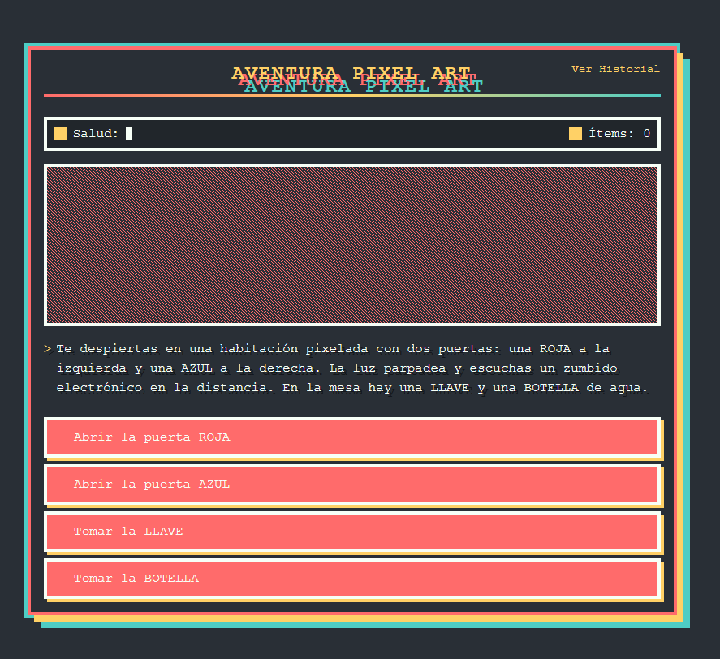

# 🎮 PixelAdventureGame - Juego de Aventuras Pixel Art con React

¡Hola aventurero! 👋 Soy Thomas Ramirez, y este es mi proyecto PixelAdventureGame: un juego interactivo de decisiones con estilo pixel art, creado con React, HTML y CSS puro.

[]

## 📸 Captura de Pantalla

## 🔧 Tecnologías Usadas
- **React 18** (Hooks: useState, efectos)
- **CSS3** (Variables custom, Grid, animaciones)
- **Diseño Pixel Art** (Imágenes generadas con CSS)
- **Git & GitHub Pages** (Deploy automático)
- **Babel Standalone** (Transpilación en navegador)
- **HTML5** (Estructura semántica)

## 🛠️ Proceso de Desarrollo (Batalla Épica):
Luché contra bugs legendarios para lograr:
- **Sistema de escenas ramificadas** (¡15+ finales distintos!)
- **Inventario interactivo** (Llaves, botellas y más)
- **Efectos visuales** (Glitch, parpadeo, sombras pixeladas)
- **Modo responsive** (Funciona hasta en móviles)
- **Logros secretos** (¡Descúbrelos todos!)

## 📂 Estructura del Proyecto

## PixelAdventureGame/
## ├── index.html
## ├── styles/
## │   ├── main.css
## │   └── responsive.css
## ├── scripts/
## │   ├── app.js
## │   ├── scenes.js
## │   └── components/
## │       └── Game.js
## └── assets/

## 💡 Características Destacadas

    ✅ 15+ escenas con múltiples caminos
    ✅ Sistema de inventario (llaves, objetos)
    ✅ 6 finales diferentes con logros
    ✅ Efectos visuales pixelados (glitch, parpadeo)
    ✅ Totalmente responsive

## 🚀 ¿Cómo probarlo?

    Clona el repositorio

    Abre index.html en tu navegador

    ¡Toma decisiones y descubre todos los finales!

## 📝 Licencia

MIT License - Libre para modificar y distribuir

## ¡Dale ⭐ al proyecto si disfrutaste la aventura! Fue un gran desafío crear toda la lógica de decisiones y el diseño pixel art puro con CSS.

## 💡 Pro Tip: El fondo está generado completamente con CSS usando gradientes complejos y propiedades de pixelado.

## 🚧 Próximas Mejoras:

    Añadir efectos de sonido

    Más escenas secretas

    Sistema de puntuación

## ¡Gracias por jugar! 🎮💙